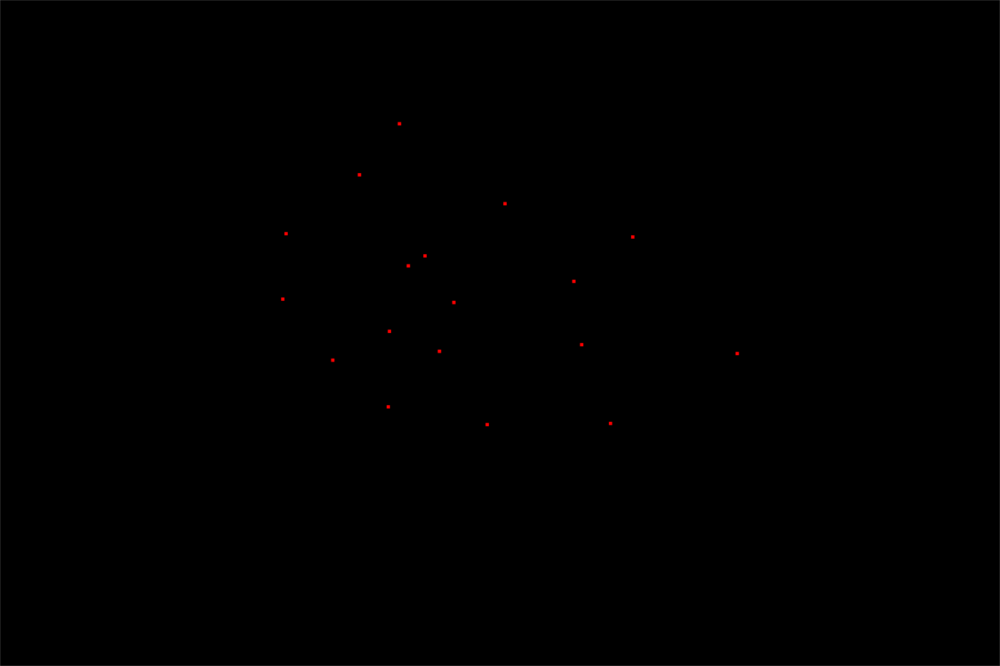
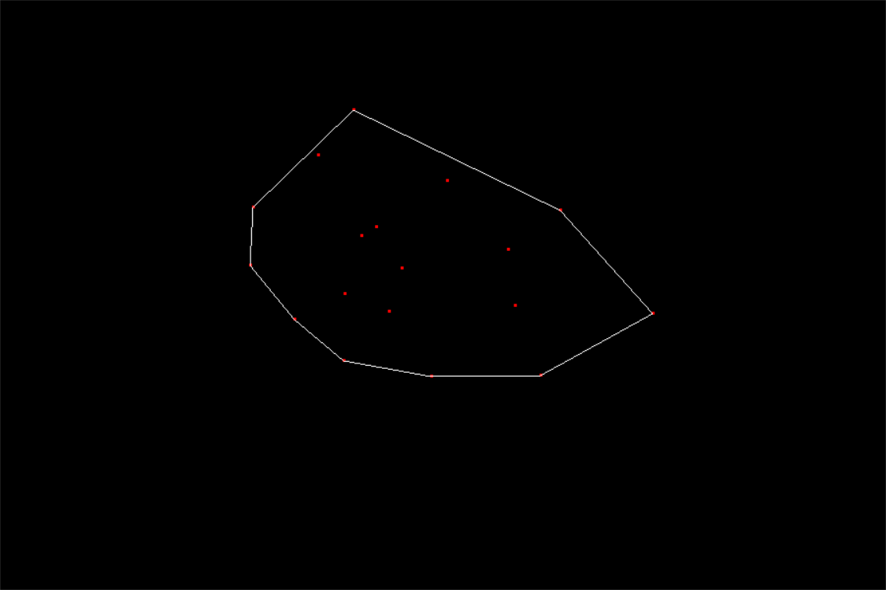

# Graham's Scan

**Implementation of Graham's Scan, Using OpenGL**

---

## Explanation

- Left click in the window to draw the point
- Right click to random generate 20 points in the graph 
- Press Enter to form the convex hull for points
- Press space to restart. 

## Build
    git clone https://github.com/PTYin/data_structure.git
    cd data_structure/graphics
    mkdir cmake-build-debug
    cd cmake-build-debug
    cmake .. && make
    ./GrahamsScan.exe