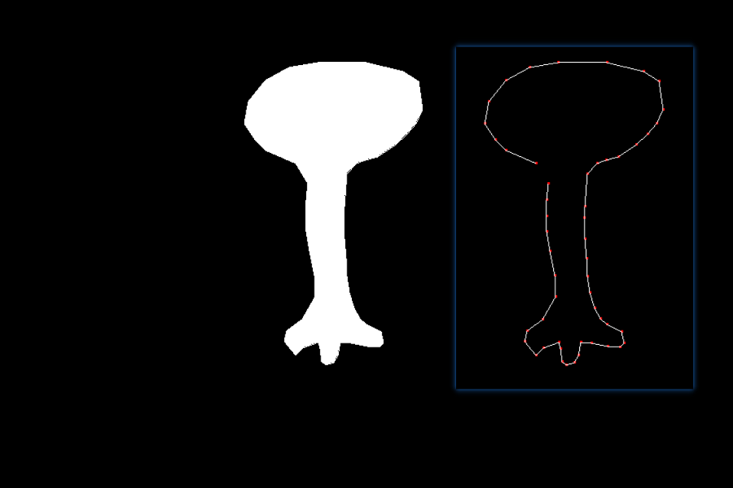

# Scan Line Polygon Fill Algorithm

**Implementation of SLPF, Using OpenGL, Practice of Balanced Tree**

## Explanation

- Left click in the window to draw the point
- Right click to close the polygon, and then fill the polygon 
- Note that: Self-crossing polygon is not allowed in the program, so it banned you from drawing lines that cross others.
- Press space to restart. 

## Build
    git clone https://github.com/PTYin/data_structure.git
    cd data_structure/graphics
    mkdir cmake-build-debug
    cd cmake-build-debug
    cmake .. && make
    ./SLPF.exe